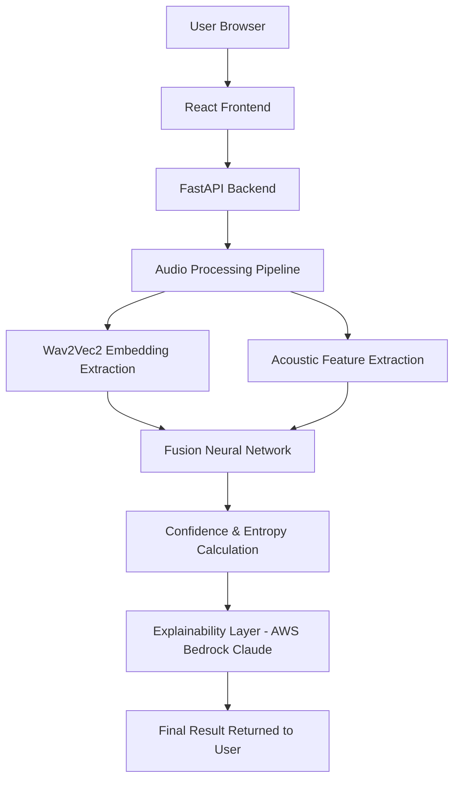

# VAANI — AI Voice Authenticity Detection


VAANI is an AI-powered system that detects whether a voice recording is **human or AI-generated** using neural acoustic analysis and speech signal modeling.

The system analyzes short audio clips and classifies them as:

• Human Voice  
• AI Generated Voice  
• Inconclusive  

VAANI combines **deep speech embeddings** with **acoustic signal analysis** to detect patterns typical of synthetic voices.

---

# Problem Statement

AI voice cloning technologies can now replicate human voices with high realism.

These tools are increasingly used in:

- Scam calls  
- Misinformation campaigns  
- Identity fraud  

Distinguishing human speech from AI-generated voices is therefore becoming an important security challenge.

VAANI addresses this problem by analyzing acoustic characteristics of speech and identifying patterns commonly associated with synthetic voices.

---

# Solution Overview

VAANI analyzes uploaded voice recordings and determines voice authenticity.

The system produces:

• Prediction label  
• Confidence score  
• Signal certainty metrics  
• Acoustic feature analysis  

Predictions fall into three categories:

Human Voice  
AI Generated Voice  
Inconclusive  

---

# Demo

Below is an example workflow of the system.

Upload → Analyze → Result


*(Replace with a short screen recording of the UI once available.)*

---

# System Architecture



The frontend communicates with the backend API which processes audio and runs the machine learning model.

---

# How the System Works

Audio Upload  
↓  
Audio Preprocessing  
↓  
Wav2Vec2 Embedding Extraction  
↓  
Acoustic Feature Extraction  
↓  
Fusion Neural Network Classification  
↓  
Confidence & Entropy Calculation  
↓  
Human / AI / Inconclusive Result  

Entropy is used to determine uncertainty in predictions.

---

# Technology Stack

## Backend

- FastAPI  
- PyTorch  
- HuggingFace Transformers  
- Librosa  

## Frontend

- React  
- TypeScript  
- Vite  
- Tailwind CSS  

## Infrastructure

- AWS EC2  
- AWS Bedrock (Claude) for explainability  

---

# Quick Start

Clone repository:

```
git clone https://github.com/<username>/vaani.git
cd vaani
```

---

# Setup Instructions

<details>

<summary><b>Backend Setup</b></summary>

Create virtual environment

```
python -m venv venv
```

Activate environment

Windows

```
venv\Scripts\activate
```

Install dependencies

```
pip install -r requirements.txt
```

Start backend server

```
uvicorn app.main:app --reload
```

Backend will run at

```
http://127.0.0.1:8000
```

API documentation

```
http://127.0.0.1:8000/docs
```

</details>

---

<details>

<summary><b>Frontend Setup</b></summary>

Open a new terminal

```
cd frontend
npm install
npm run dev
```

Frontend will run at

```
http://localhost:3000
```

</details>

---

# Dataset Sources

Datasets used during development:

Medley Deepfake Speech Dataset  
https://data.mendeley.com/datasets/79g59sp69z/1

Audio Deepfake Detection Dataset (Kaggle)  
https://www.kaggle.com/datasets/adarshsingh0903/audio-deepfake-detection-dataset

These datasets were used to create a balanced dataset of human and AI-generated speech samples.

Datasets are not included in this repository due to size and licensing considerations.

---

# Model Architecture

VAANI uses a **fusion architecture** combining deep speech embeddings and acoustic signal analysis.

Components include:

**Wav2Vec2 speech embeddings (1024-dimensional)**

**Acoustic speech features**

- Pitch variance  
- Spectral drift  
- Zero-crossing rate variance  

These signals are combined and processed by a neural network classifier that produces authenticity predictions.

Entropy is used to detect uncertain predictions and label them as **Inconclusive**.

---

# Project Structure

```
vaani
│
├── app
│   ├── api
│   ├── core
│   ├── ml
│   ├── services
│   └── explainability
│
├── frontend
│   └── React application
│
├── models
│   └── trained model weights
│
├── datasets
│   └── dataset references
│
├── docs
│   └── project documentation
│
├── requirements.txt
└── README.md
```

The backend handles inference while the frontend provides the user interface.

---

# Limitations

VAANI is currently trained on curated public datasets for AI voice detection.

Real-world audio recordings may introduce additional acoustic variations such as:

- Background noise  
- Microphone response differences  
- Audio compression artifacts (MP3 encoding)  
- Room reverberation  

These variations can shift acoustic feature distributions and occasionally affect classification performance.

---

# Future Improvements

Future versions of VAANI will improve robustness through:

- Expanding the training dataset with real-world microphone recordings  
- Including compressed audio formats such as MP3  
- Applying audio augmentation techniques (noise, reverberation, device simulation)  
- Improving feature normalization and calibration  
- Extending evaluation across more diverse voice environments  
- Real-time call detection  
- Mobile application interface  

These improvements will allow VAANI to generalize more effectively to real-world audio conditions.
